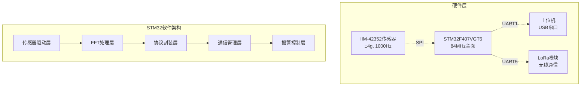
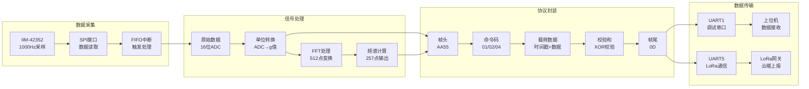
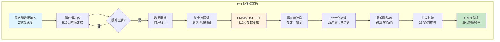
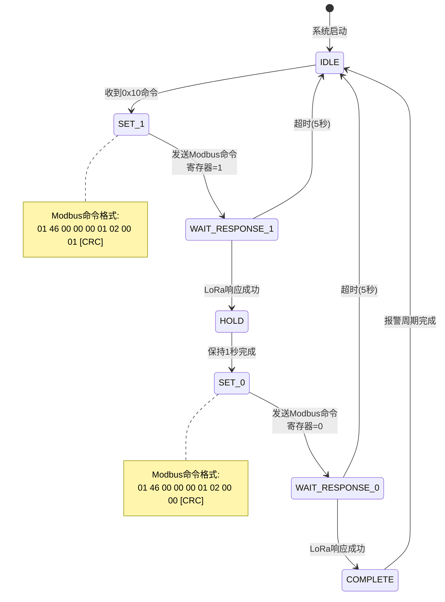
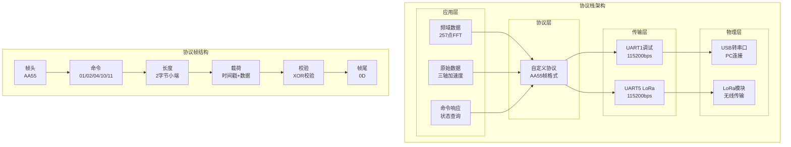
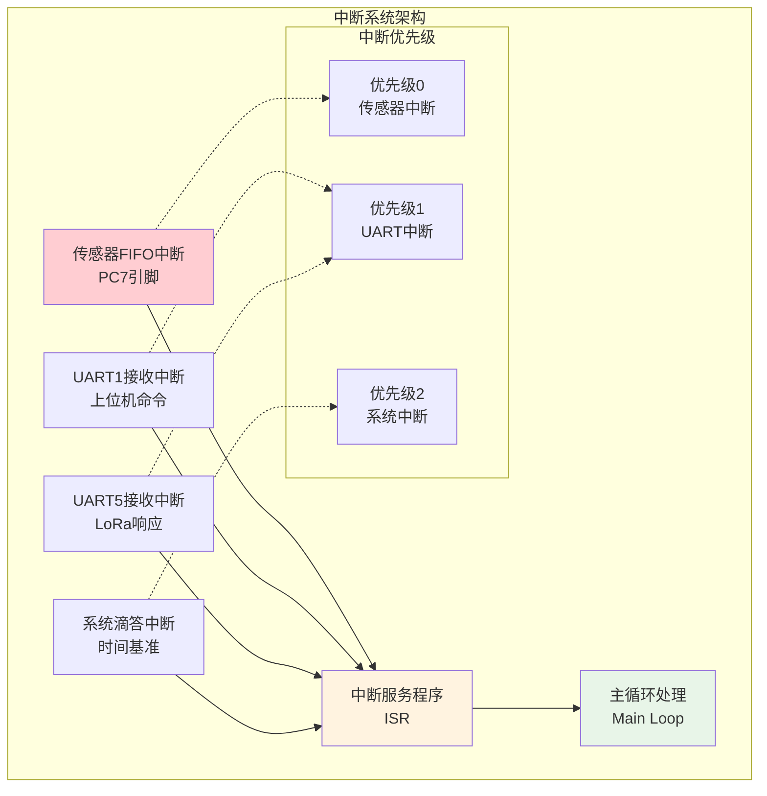
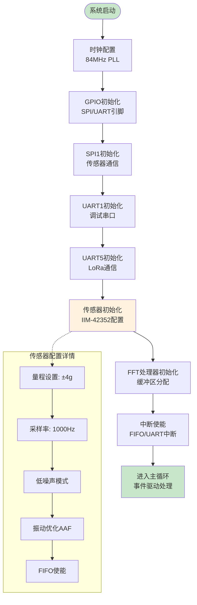
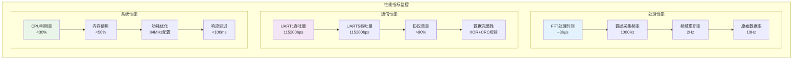
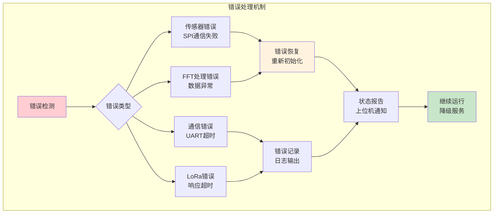
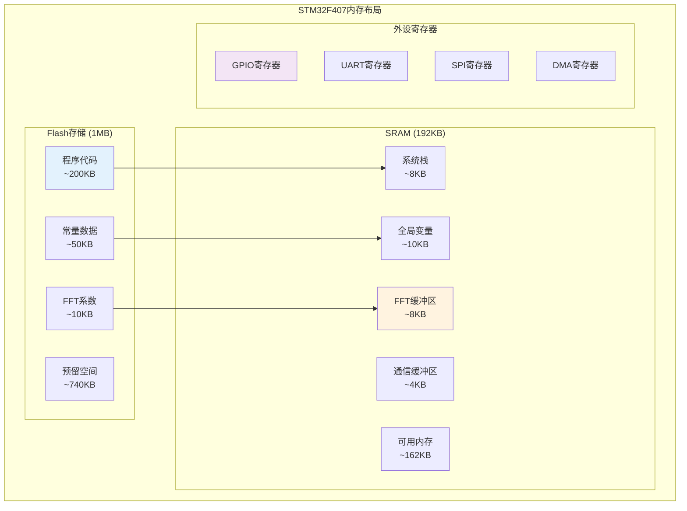

# STM32 智能挖掘检测系统架构逻辑图

## 🏗️ 系统总体架构图

## 📊 数据流架构图

## 🔄 FFT处理模块架构图

## 🚨 LoRa报警状态机图

## 📡 通信协议架构图

## ⚡ 中断处理架构图

## 🔧 系统初始化流程图

## 📈 性能监控架构图

## 🛡️ 错误处理架构图

## 📊 内存管理架构图

---

**STM32智能挖掘检测系统架构逻辑图 v3.3 - 完整的系统设计可视化** 🚀
