# STM32智能震动检测系统 - 完整流程架构图

> **文档版本：** v1.0  
> **生成日期：** 2025-01-10  
> **作者：** Bolgen Studio

---

## 📋 目录

1. [架构图说明](#架构图说明)
2. [完整流程架构图](#完整流程架构图)
3. [架构层次说明](#架构层次说明)
4. [数据流说明](#数据流说明)
5. [关键技术指标](#关键技术指标)

---

## 架构图说明

本架构图展示了STM32智能震动检测系统的完整数据流和处理流程，包含以下核心部分：

- **硬件层**：传感器、MCU、LoRa模块
- **数据采集层**：SPI通信、FIFO中断、数据转换
- **数据预处理层**：4阶Butterworth高通滤波器
- **粗检测层**：RMS滑动窗口、峰值因子检测
- **智能FFT控制**：触发模式、功耗优化95%
- **细检测层**：5维特征提取、置信度计算
- **系统状态机**：10状态事件驱动架构
- **低功耗管理**：RTC唤醒、Sleep模式、三种场景
- **通信层**：LoRa报警、Modbus协议、云端上报

---

## 完整流程架构图

```mermaid
graph TB
    subgraph "硬件层"
        A[IIM-42352传感器<br/>±4g, 1000Hz]
        B[STM32F407VGT6<br/>84MHz]
        C[LoRa模块<br/>UART5]
    end
    
    subgraph "数据采集层"
        D[SPI通信<br/>传感器数据读取]
        E[FIFO中断<br/>PC7触发]
        F[原始数据转换<br/>16位ADC → g值]
    end
    
    subgraph "数据预处理层 - 阶段1"
        G[4阶Butterworth<br/>高通滤波器<br/>5Hz截止]
        G1[DC衰减>99.9%<br/>去除1g重力偏移]
    end
    
    subgraph "粗检测层 - 阶段2"
        H[RMS滑动窗口<br/>2000样本/2秒]
        I[峰值因子计算<br/>当前RMS/基线RMS]
        J{峰值因子<br/>>1.5x?}
        K[状态机<br/>IDLE→TRIGGERED→COOLDOWN]
    end
    
    subgraph "智能FFT控制 - 阶段3"
        L{触发模式<br/>已激活?}
        M[跳过FFT<br/>功耗优化95%]
        N[512点FFT<br/>Hanning窗<br/>~36μs]
        O[频谱分析<br/>257点单边谱]
    end
    
    subgraph "细检测层 - 阶段4"
        P[5维特征提取]
        P1[低频能量<br/>5-15Hz]
        P2[中频能量<br/>15-30Hz]
        P3[高频能量<br/>30-100Hz]
        P4[主频]
        P5[频谱重心]
        Q[置信度计算<br/>加权评分]
        R{置信度<br/>>70%?}
    end
    
    subgraph "系统状态机 - 阶段5"
        S[STATE_MONITORING<br/>监测模式]
        T[STATE_COARSE_TRIGGERED<br/>粗检测触发]
        U[STATE_FINE_ANALYSIS<br/>细检测分析]
        V[STATE_MINING_DETECTED<br/>挖掘检测到]
        W[STATE_ALARM_SENDING<br/>报警发送中]
        X[STATE_ALARM_COMPLETE<br/>报警完成]
    end
    
    subgraph "低功耗管理 - 阶段6"
        Y[RTC定时唤醒<br/>2秒周期]
        Z[Sleep模式<br/>功耗<1mA]
        AA[Wake处理<br/>传感器启动]
        AB{检测完成?}
        AC[场景1: 无振动<br/>~2.5秒]
        AD[场景2: 正常振动<br/>~14-15秒]
        AE[场景3: 挖掘振动<br/>~22秒]
    end
    
    subgraph "通信层"
        AF[LoRa报警<br/>Modbus协议]
        AG[寄存器置1<br/>保持1秒<br/>寄存器置0]
        AH[CRC16校验]
        AI[云端上报]
    end
    
    %% 数据流连接
    A -->|SPI1| D
    D --> E
    E --> F
    F --> G
    G --> G1
    G1 --> H
    H --> I
    I --> J
    
    J -->|否| K
    J -->|是| K
    K --> L
    
    L -->|未触发| M
    L -->|已触发| N
    M --> S
    N --> O
    O --> P
    
    P --> P1
    P --> P2
    P --> P3
    P --> P4
    P --> P5
    P1 & P2 & P3 & P4 & P5 --> Q
    Q --> R
    
    R -->|否<br/>正常振动| S
    R -->|是<br/>挖掘振动| V
    
    %% 状态机流转
    S -->|粗检测触发| T
    T -->|FFT完成| U
    U -->|细检测完成| V
    V -->|触发报警| W
    W -->|报警成功| X
    X -->|返回监测| S
    
    %% 低功耗流程
    Y --> Z
    Z -->|RTC中断| AA
    AA --> H
    AB -->|场景1| AC
    AB -->|场景2| AD
    AB -->|场景3| AE
    AC & AD & AE --> Z
    
    %% 报警流程
    W --> AF
    AF --> AG
    AG --> AH
    AH --> AI
    AI --> X
    
    %% 样式定义
    classDef hardware fill:#e1f5ff,stroke:#01579b,stroke-width:2px
    classDef processing fill:#f3e5f5,stroke:#4a148c,stroke-width:2px
    classDef detection fill:#fff3e0,stroke:#e65100,stroke-width:2px
    classDef statemachine fill:#e8f5e9,stroke:#1b5e20,stroke-width:2px
    classDef lowpower fill:#fce4ec,stroke:#880e4f,stroke-width:2px
    classDef communication fill:#e0f2f1,stroke:#004d40,stroke-width:2px
    
    class A,B,C hardware
    class D,E,F,G,G1 processing
    class H,I,J,K,L,M,N,O detection
    class P,P1,P2,P3,P4,P5,Q,R detection
    class S,T,U,V,W,X statemachine
    class Y,Z,AA,AB,AC,AD,AE lowpower
    class AF,AG,AH,AI communication
```



---

## 架构层次说明

### 1. 硬件层
**功能：** 提供基础硬件支持

| 组件 | 型号/规格 | 功能 |
|------|----------|------|
| 传感器 | IIM-42352 | 6轴IMU，±4g量程，1000Hz采样 |
| 主控MCU | STM32F407VGT6 | 84MHz主频，192KB RAM，1MB Flash |
| 通信模块 | LoRa模块 | 无线通信，UART5接口，115200bps |

### 2. 数据采集层
**功能：** 传感器数据采集和初步处理

- **SPI通信**：高速读取传感器FIFO数据
- **FIFO中断**：PC7引脚中断触发，1000Hz频率
- **数据转换**：16位ADC值转换为物理量（g值）

### 3. 数据预处理层（阶段1）
**功能：** 去除DC分量和低频干扰

- **滤波器类型**：4阶Butterworth高通滤波器
- **截止频率**：5Hz
- **DC衰减**：>99.9%
- **实现方式**：直接形式IIR，避开CMSIS DSP bug

### 4. 粗检测层（阶段2）
**功能：** 快速检测振动异常

- **RMS窗口**：2000样本（2秒@1000Hz）
- **触发阈值**：峰值因子>1.5x基线RMS
- **状态机**：IDLE→TRIGGERED→COOLDOWN
- **响应时间**：<50ms

### 5. 智能FFT控制（阶段3）
**功能：** 按需激活FFT，优化功耗

- **触发模式**：粗检测触发后才激活
- **功耗优化**：95%（未触发时完全跳过）
- **FFT规格**：512点，Hanning窗，~36μs处理时间
- **频谱输出**：257点单边谱，1.953Hz分辨率

### 6. 细检测层（阶段4）
**功能：** 智能分类和置信度评估

**5维特征：**
1. 低频能量占比（5-15Hz）
2. 中频能量占比（15-30Hz）
3. 高频能量占比（30-100Hz）
4. 主频
5. 频谱重心

**分类决策：**
- 置信度>70%：挖掘振动
- 置信度<70%：正常振动
- 实际精度：75-85%

### 7. 系统状态机（阶段5）
**功能：** 事件驱动的系统控制

**10个状态：**
1. STATE_SYSTEM_INIT - 系统初始化
2. STATE_IDLE_SLEEP - 深度休眠
3. STATE_MONITORING - 监测模式
4. STATE_COARSE_TRIGGERED - 粗检测触发
5. STATE_FINE_ANALYSIS - 细检测分析
6. STATE_MINING_DETECTED - 挖掘检测到
7. STATE_ALARM_SENDING - 报警发送中
8. STATE_ALARM_COMPLETE - 报警完成
9. STATE_ERROR_HANDLING - 错误处理
10. STATE_SYSTEM_RESET - 系统重置

**性能指标：**
- 状态转换时间：<50μs
- 完整检测流程：<1秒

### 8. 低功耗管理（阶段6）
**功能：** RTC定时唤醒和功耗优化

**三种应用场景：**

| 场景 | 时间 | 功耗 | 说明 |
|------|------|------|------|
| 场景1：无振动 | ~2.5秒 | ~3mA | 粗检测未触发，快速退出 |
| 场景2：正常振动 | ~14-15秒 | ~8mA | 完整检测，识别为正常 |
| 场景3：挖掘振动 | ~22秒 | ~12mA | 完整检测+LoRa报警 |

**功耗管理：**
- RTC唤醒周期：2秒
- Sleep模式功耗：<1mA
- Sleep占比：70-75%
- 综合平均功耗：7.29mA
- 电池寿命（3000mAh）：17.2天

### 9. 通信层
**功能：** LoRa无线报警和云端上报

**Modbus协议：**
- 寄存器置1：`01 46 00 00 00 01 02 00 01 [CRC]`
- 保持1秒
- 寄存器置0：`01 46 00 00 00 01 02 00 00 [CRC]`
- CRC16校验

**报警流程：**
1. 检测到挖掘振动
2. 触发LoRa报警
3. 发送Modbus命令（寄存器置1）
4. 等待响应确认
5. 保持1秒
6. 发送Modbus命令（寄存器置0）
7. 等待响应确认
8. 报警完成

---

## 数据流说明

### 主数据流路径

```
传感器采样 → SPI读取 → FIFO中断 → 数据转换 → 高通滤波 → 粗检测
    ↓
RMS窗口计算 → 峰值因子判断 → 触发控制 → FFT处理 → 频谱分析
    ↓
5维特征提取 → 置信度计算 → 分类决策 → 状态机控制 → LoRa报警
```

### 低功耗模式数据流

```
RTC定时器 → Sleep模式 → RTC唤醒中断 → Wake处理 → 传感器启动
    ↓
数据采集（2000样本） → 粗检测判断 → 场景识别
    ↓
场景1: 快速退出 → Sleep
场景2: 完整检测 → Sleep
场景3: 检测+报警 → Sleep
```

---

## 关键技术指标

### 实时性能

| 处理环节 | 处理时间 | 说明 |
|---------|---------|------|
| 数据采集 | 1ms | 1000Hz连续采样 |
| 滤波处理 | <10μs | 单点处理时间 |
| 粗检测 | <50ms | 响应时间 |
| FFT处理 | ~36μs | 512点CMSIS DSP |
| 细检测 | <200μs | 特征提取时间 |
| 状态转换 | <50μs | 状态切换时间 |
| **完整流程** | **<1秒** | **超过<3秒目标** |

### 功耗性能

| 场景 | 时间 | 平均功耗 | 说明 |
|------|------|----------|------|
| 场景1（无振动） | ~2.5秒 | ~3mA | 快速完成 |
| 场景2（正常振动） | ~14-15秒 | ~8mA | 完整检测 |
| 场景3（挖掘振动） | ~22秒 | ~12mA | 含LoRa报警 |
| **综合平均** | - | **7.29mA** | **电池寿命17.2天** |

### 检测精度

| 指标 | 目标值 | 实际达成 | 状态 |
|------|--------|----------|------|
| 滤波器DC衰减 | >90% | >99.9% | ✅ 超额完成 |
| 粗检测响应时间 | <100ms | <50ms | ✅ 超额完成 |
| FFT功耗优化 | >90% | 95% | ✅ 超额完成 |
| 细检测分类精度 | >70% | 75-85% | ✅ 超额完成 |
| 完整检测流程 | <3秒 | <1秒 | ✅ 超额完成 |
| 综合平均功耗 | <10mA | 7.29mA | ✅ 超额完成 |
| 电池寿命(3000mAh) | >10天 | 17.2天 | ✅ 超额完成 |

---

## 使用说明

### 如何查看架构图

1. **在线查看**：使用支持Mermaid的Markdown编辑器（如Typora、VS Code + Mermaid插件）
2. **导出图片**：使用Mermaid Live Editor（https://mermaid.live/）导出PNG/SVG
3. **集成到文档**：直接复制Mermaid代码到支持的文档系统

### 架构图更新

如需更新架构图，请修改Mermaid代码块中的内容，主要修改点：
- 节点定义：修改方括号内的文本
- 连接关系：修改箭头和连接线
- 样式定义：修改classDef和class语句

---

## 相关文档

- **[STM32智能震动检测系统_代码架构分析文档.md](STM32智能震动检测系统_代码架构分析文档.md)** - 完整的代码架构分析
- **[README.md](README.md)** - 项目概述和快速入门

---

**文档版本：** v1.0  
**最后更新：** 2025-01-10  
**作者：** Bolgen Studio

