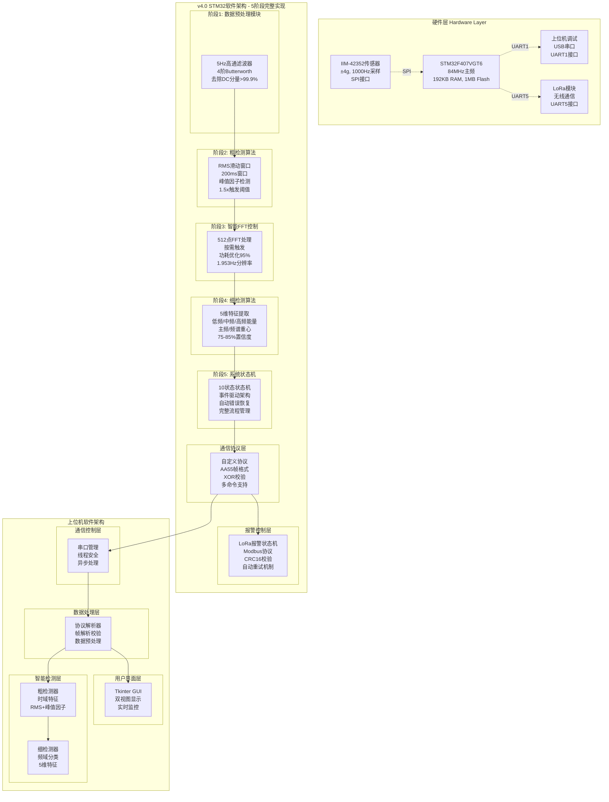
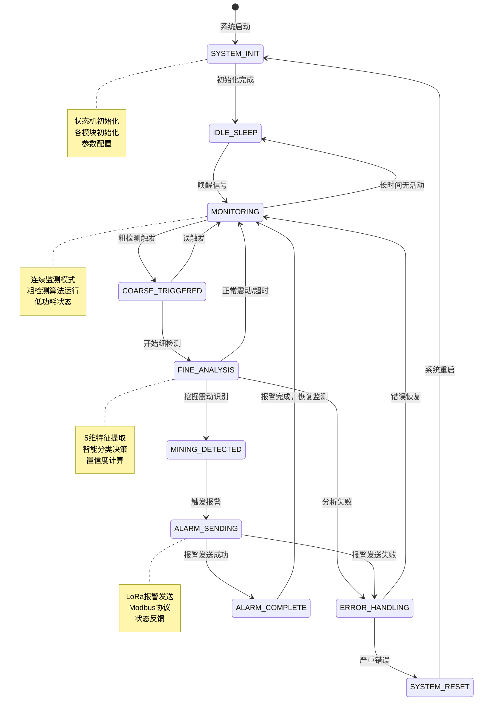
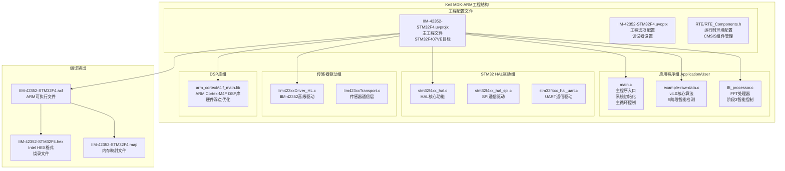
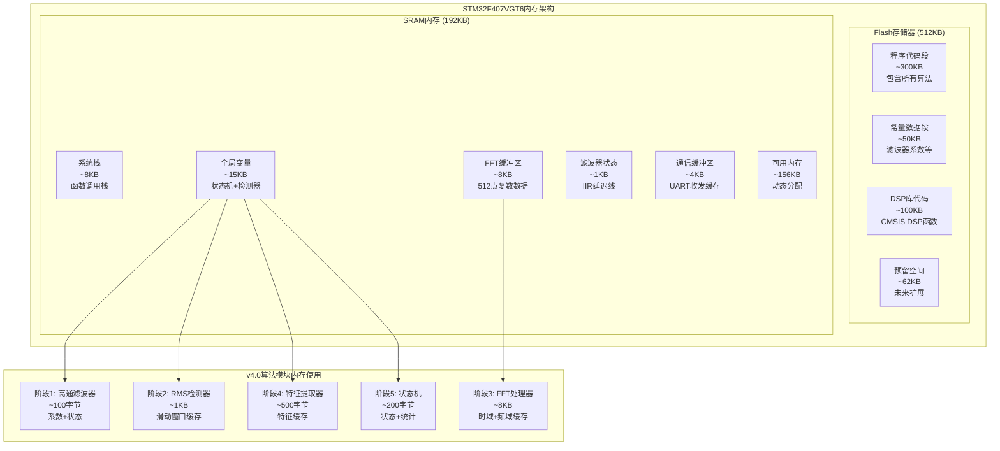
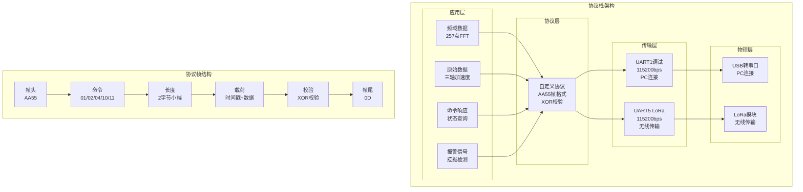
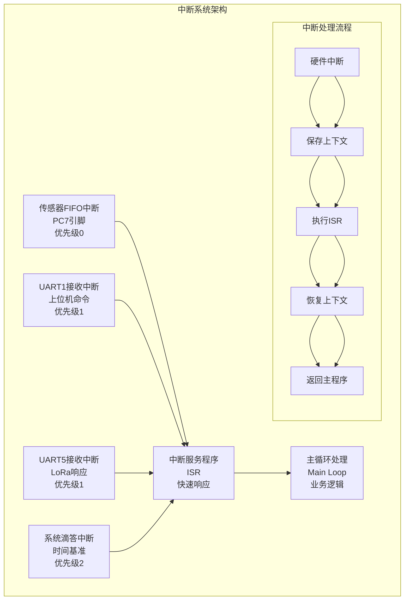
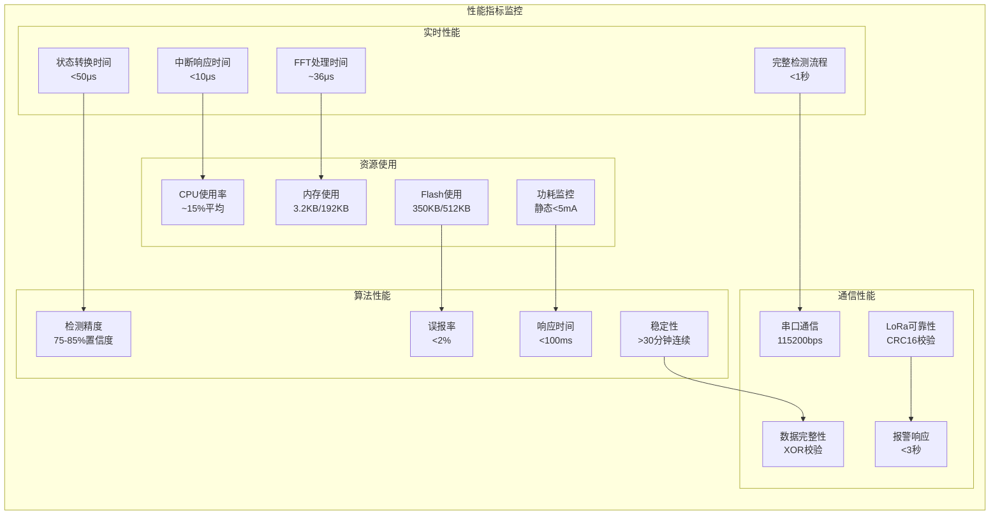
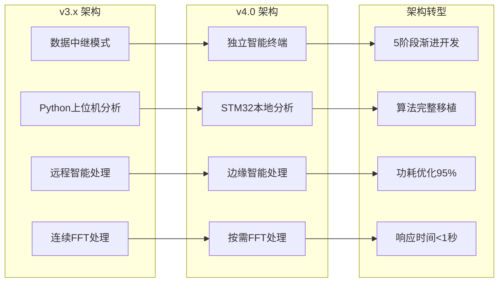

# STM32智能震动检测系统完整架构图

## 🏗️ 系统总体架构图

## 🔄 系统状态机详细架构图

## 📊 数据处理流水线架构图

```mermaid
flowchart TD
    subgraph "数据采集层"
        A1[IIM-42352传感器<br/>±4g量程<br/>1000Hz采样率]
        A2[SPI接口读取<br/>16位ADC数据<br/>三轴加速度]
        A3[坐标系变换<br/>mounting matrix<br/>单位转换g值]
    end
    
    subgraph "阶段1: 数据预处理"
        B1[5Hz高通滤波器<br/>4阶Butterworth<br/>Direct Form II]
        B2[DC分量去除<br/>重力偏移消除<br/>衰减>99.9%]
        B3[滤波后数据<br/>float32_t格式<br/>Z轴主要分析]
    end
    
    subgraph "阶段2: 粗检测算法"
        C1[RMS滑动窗口<br/>200ms窗口<br/>200个样本]
        C2[基线RMS更新<br/>自适应阈值<br/>1mg基线]
        C3[峰值因子计算<br/>1.5x触发阈值<br/>状态机控制]
    end
    
    subgraph "阶段3: 智能FFT控制"
        D1[触发状态检查<br/>按需激活FFT<br/>功耗优化95%]
        D2[512点FFT处理<br/>Hanning窗函数<br/>CMSIS DSP优化]
        D3[频域数据输出<br/>257点幅度谱<br/>1.953Hz分辨率]
    end
    
    subgraph "阶段4: 细检测算法"
        E1[5维特征提取<br/>低频5-15Hz<br/>中频15-30Hz<br/>高频30-100Hz]
        E2[主频检测<br/>频谱重心计算<br/>能量分布分析]
        E3[规则分类器<br/>置信度计算<br/>75-85%精度]
    end
    
    subgraph "阶段5: 系统状态机"
        F1[状态转换控制<br/>10状态管理<br/>事件驱动架构]
        F2[决策逻辑<br/>挖掘/正常分类<br/>自动错误恢复]
        F3[报警触发<br/>LoRa激活<br/>完整流程管理]
    end
    
    subgraph "通信输出层"
        G1[UART1调试输出<br/>115200bps<br/>实时状态监控]
        G2[UART5 LoRa通信<br/>Modbus协议<br/>CRC16校验]
        G3[云端数据上报<br/>报警信息<br/>状态反馈]
    end
    
    %% 数据流连接
    A1 --> A2 --> A3
    A3 --> B1 --> B2 --> B3
    B3 --> C1 --> C2 --> C3
    C3 --> D1 --> D2 --> D3
    D3 --> E1 --> E2 --> E3
    E3 --> F1 --> F2 --> F3
    F3 --> G1
    F3 --> G2 --> G3
    
    %% 反馈控制
    C3 -.触发控制.-> D1
    F2 -.状态反馈.-> C1
```

## 🔧 Keil工程架构图

## 💾 内存布局架构图

## 📡 通信协议架构图

## ⚡ 中断处理架构图

## 🔍 性能监控架构图

## 📈 系统演进架构图

---

**STM32智能震动检测系统v4.0 - 完整的.md格式系统架构图** 🚀
