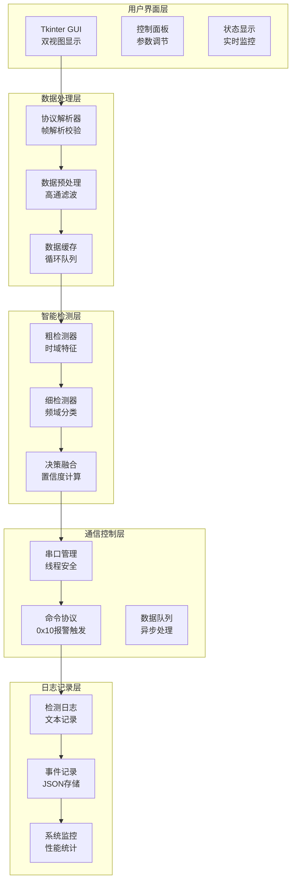
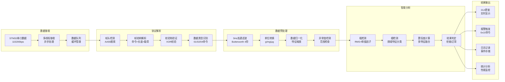
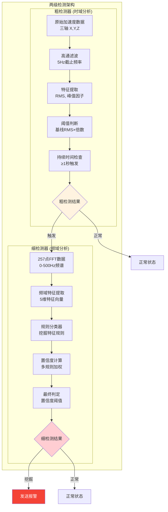
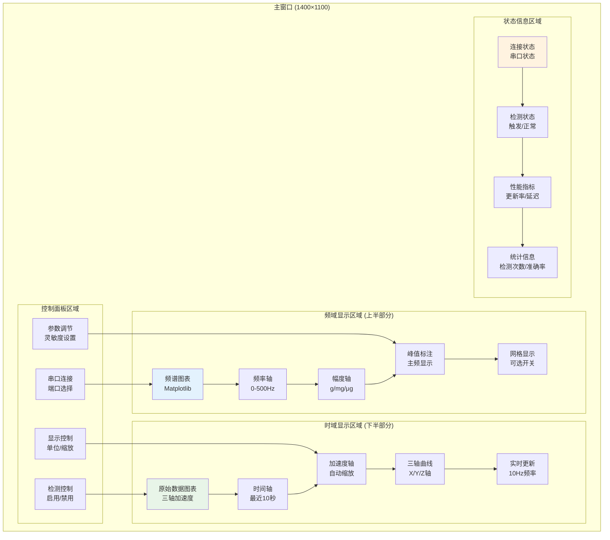
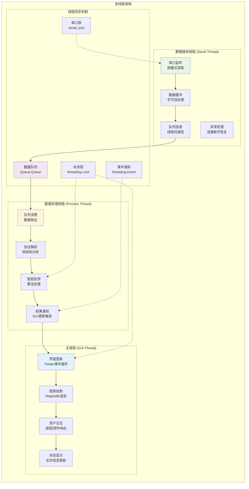
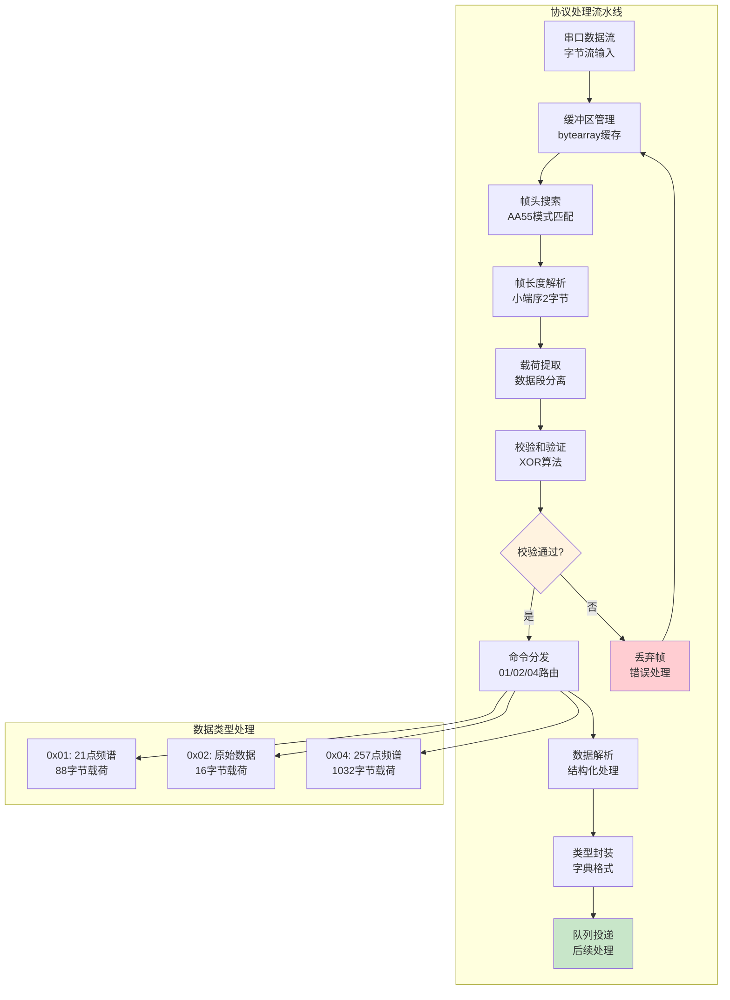
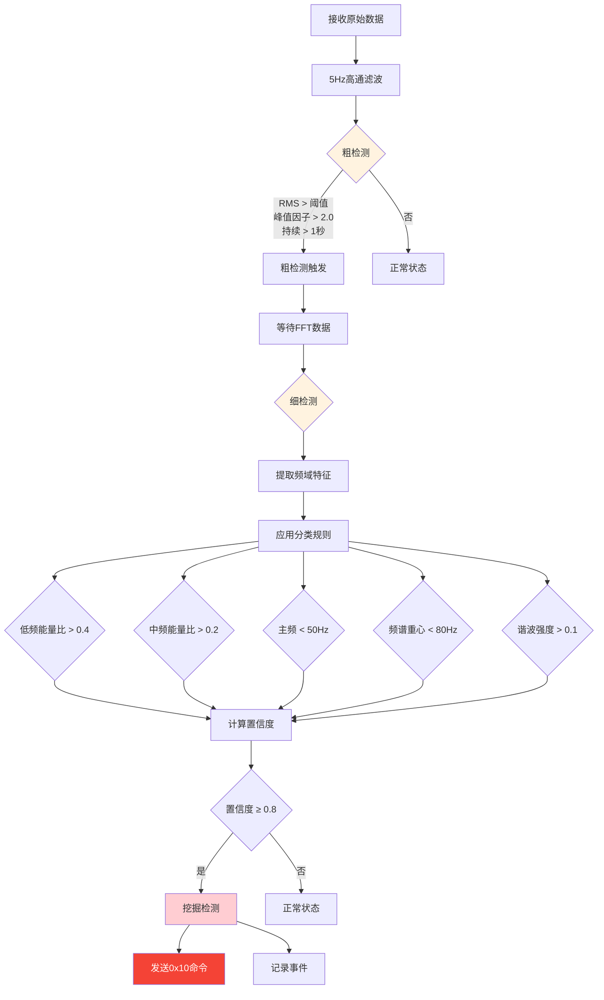
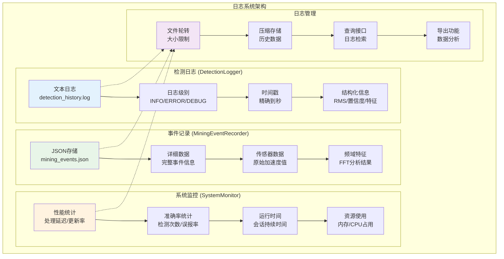

# 上位机智能挖掘检测系统架构逻辑图

## 🏗️ 系统总体架构图



## 📊 数据流架构图



## 🧠 智能检测算法架构图



## 🎛️ GUI双视图架构图



## 🔄 多线程架构图



## 📡 通信协议处理架构图



## 🎯 智能检测决策树



## 📊 数据缓存管理架构图

```mermaid
graph LR
    subgraph "数据缓存架构"
        subgraph "频域数据缓存"
            F1[频谱缓存<br/>deque(100)]
            F2[频率数组<br/>257点固定]
            F3[幅度数组<br/>动态更新]
            F4[时间戳<br/>更新追踪]
        end
        
        subgraph "时域数据缓存"
            T1[X轴缓存<br/>deque(1000)]
            T2[Y轴缓存<br/>deque(1000)]
            T3[Z轴缓存<br/>deque(1000)]
            T4[时间缓存<br/>deque(1000)]
        end
        
        subgraph "检测结果缓存"
            D1[粗检测结果<br/>deque(100)]
            D2[细检测结果<br/>deque(100)]
            D3[置信度历史<br/>统计分析]
            D4[事件记录<br/>JSON存储]
        end
        
        subgraph "缓存管理策略"
            M1[自动清理<br/>超出长度丢弃]
            M2[内存监控<br/>使用量统计]
            M3[性能优化<br/>批量操作]
            M4[线程安全<br/>锁保护]
        end
    end
    
    F1 --> F2 --> F3 --> F4
    T1 --> T2 --> T3 --> T4
    D1 --> D2 --> D3 --> D4
    M1 --> M2 --> M3 --> M4
    
    F1 -.-> M1
    T1 -.-> M1
    D1 -.-> M1
    
    style F1 fill:#e3f2fd
    style T1 fill:#e8f5e8
    style D1 fill:#fff3e0
    style M1 fill:#f3e5f5
```

## 🔍 日志记录架构图



## ⚡ 性能优化架构图

```mermaid
graph LR
    subgraph "性能优化策略"
        subgraph "数据处理优化"
            D1[NumPy向量化<br/>批量计算]
            D2[SciPy优化算法<br/>高效滤波]
            D3[内存预分配<br/>避免动态分配]
            D4[数据类型优化<br/>float32精度]
        end
        
        subgraph "GUI渲染优化"
            G1[增量更新<br/>只更新变化区域]
            G2[帧率控制<br/>限制更新频率]
            G3[双缓冲技术<br/>避免闪烁]
            G4[异步渲染<br/>非阻塞更新]
        end
        
        subgraph "内存管理优化"
            M1[循环缓冲区<br/>固定内存占用]
            M2[对象池技术<br/>减少GC压力]
            M3[惰性加载<br/>按需分配]
            M4[内存监控<br/>泄漏检测]
        end
        
        subgraph "算法优化"
            A1[特征缓存<br/>避免重复计算]
            A2[阈值预计算<br/>减少运算]
            A3[并行处理<br/>多核利用]
            A4[算法简化<br/>规则分类器]
        end
    end
    
    D1 --> D2 --> D3 --> D4
    G1 --> G2 --> G3 --> G4
    M1 --> M2 --> M3 --> M4
    A1 --> A2 --> A3 --> A4
    
    style D1 fill:#e3f2fd
    style G1 fill:#e8f5e8
    style M1 fill:#fff3e0
    style A1 fill:#f3e5f5
```



---

**Python智能挖掘检测上位机架构逻辑图 v3.3 - 完整的软件设计可视化** 🚀
