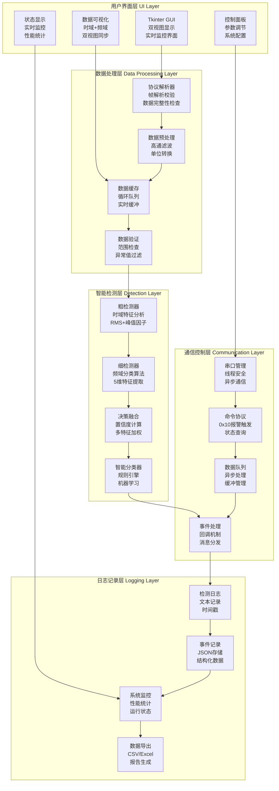
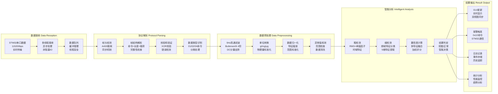
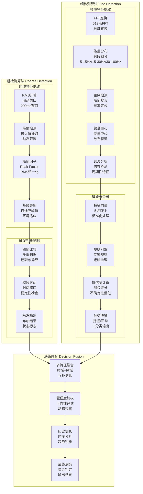
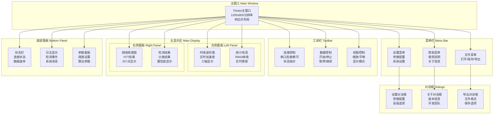
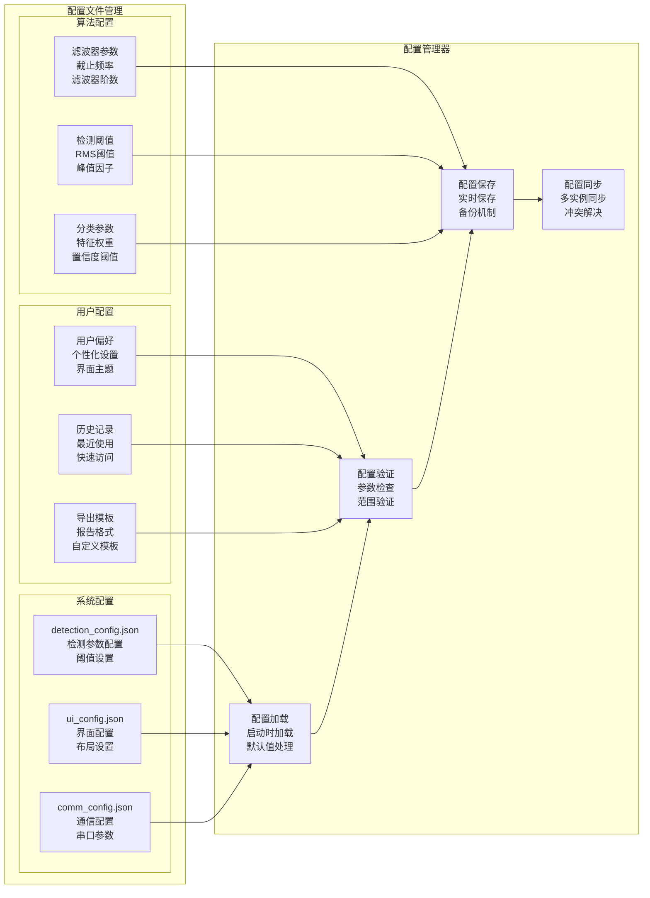

# 上位机智能挖掘检测系统架构图

## 🏗️ 上位机系统总体架构图

```mermaid
graph TB
    subgraph "用户界面层 UI Layer"
        GUI[Tkinter GUI<br/>双视图显示<br/>实时监控界面]
        CONTROL[控制面板<br/>参数调节<br/>系统配置]
        STATUS[状态显示<br/>实时监控<br/>性能统计]
        PLOT[数据可视化<br/>时域+频域<br/>双视图同步]
    end
    
    subgraph "数据处理层 Data Processing Layer"
        PARSER[协议解析器<br/>帧解析校验<br/>数据完整性检查]
        PREPROC[数据预处理<br/>高通滤波<br/>单位转换]
        BUFFER[数据缓存<br/>循环队列<br/>实时缓冲]
        VALIDATOR[数据验证<br/>范围检查<br/>异常值过滤]
    end
    
    subgraph "智能检测层 Detection Layer"
        COARSE[粗检测器<br/>时域特征分析<br/>RMS+峰值因子]
        FINE[细检测器<br/>频域分类算法<br/>5维特征提取]
        DECISION[决策融合<br/>置信度计算<br/>多特征加权]
        CLASSIFIER[智能分类器<br/>规则引擎<br/>机器学习]
    end
    
    subgraph "通信控制层 Communication Layer"
        SERIAL[串口管理<br/>线程安全<br/>异步通信]
        PROTOCOL[命令协议<br/>0x10报警触发<br/>状态查询]
        QUEUE[数据队列<br/>异步处理<br/>缓冲管理]
        HANDLER[事件处理<br/>回调机制<br/>消息分发]
    end
    
    subgraph "日志记录层 Logging Layer"
        LOGGER[检测日志<br/>文本记录<br/>时间戳]
        RECORDER[事件记录<br/>JSON存储<br/>结构化数据]
        MONITOR[系统监控<br/>性能统计<br/>运行状态]
        EXPORT[数据导出<br/>CSV/Excel<br/>报告生成]
    end
    
    %% 层间连接
    GUI --> PARSER
    CONTROL --> SERIAL
    STATUS --> MONITOR
    PLOT --> BUFFER
    
    PARSER --> PREPROC
    PREPROC --> BUFFER
    BUFFER --> VALIDATOR
    VALIDATOR --> COARSE
    
    COARSE --> FINE
    FINE --> DECISION
    DECISION --> CLASSIFIER
    CLASSIFIER --> HANDLER
    
    SERIAL --> PROTOCOL
    PROTOCOL --> QUEUE
    QUEUE --> HANDLER
    HANDLER --> LOGGER
    
    LOGGER --> RECORDER
    RECORDER --> MONITOR
    MONITOR --> EXPORT
```

## 📊 上位机数据流架构图

```mermaid
flowchart LR
    subgraph "数据接收 Data Reception"
        A1[STM32串口数据<br/>115200bps<br/>实时传输]
        A2[多线程接收<br/>异步处理<br/>非阻塞IO]
        A3[数据队列<br/>缓冲管理<br/>线程安全]
    end
    
    subgraph "协议解析 Protocol Parsing"
        B1[帧头检测<br/>AA55搜索<br/>同步机制]
        B2[帧结构解析<br/>命令+长度+载荷<br/>完整性检查]
        B3[校验和验证<br/>XOR校验<br/>错误检测]
        B4[数据类型识别<br/>01/02/04命令<br/>分类处理]
    end
    
    subgraph "数据预处理 Data Preprocessing"
        C1[5Hz高通滤波<br/>Butterworth 4阶<br/>DC分量去除]
        C2[单位转换<br/>g/mg/μg<br/>物理量标准化]
        C3[数据归一化<br/>特征缩放<br/>范围标准化]
        C4[异常值检测<br/>范围检查<br/>数据清洗]
    end
    
    subgraph "智能分析 Intelligent Analysis"
        D1[粗检测<br/>RMS+峰值因子<br/>时域特征]
        D2[细检测<br/>频域特征分类<br/>5维特征提取]
        D3[置信度计算<br/>多特征融合<br/>加权评分]
        D4[结果判定<br/>挖掘/正常<br/>智能决策]
    end
    
    subgraph "结果输出 Result Output"
        E1[GUI更新<br/>实时显示<br/>双视图同步]
        E2[报警触发<br/>0x10命令<br/>STM32通信]
        E3[日志记录<br/>事件存储<br/>历史追踪]
        E4[统计分析<br/>性能监控<br/>趋势分析]
    end
    
    %% 数据流连接
    A1 --> A2 --> A3
    A3 --> B1 --> B2 --> B3 --> B4
    B4 --> C1 --> C2 --> C3 --> C4
    C4 --> D1 --> D2 --> D3 --> D4
    D4 --> E1
    D4 --> E2
    D4 --> E3
    D4 --> E4
```

## 🧠 智能检测算法架构图

```mermaid
graph TB
    subgraph "粗检测算法 Coarse Detection"
        subgraph "时域特征提取"
            CD1[RMS计算<br/>滑动窗口<br/>200ms窗口]
            CD2[峰值检测<br/>最大值提取<br/>动态范围]
            CD3[峰值因子<br/>Peak Factor<br/>RMS归一化]
            CD4[基线更新<br/>自适应阈值<br/>环境适应]
        end
        
        subgraph "触发判断逻辑"
            CD5[阈值比较<br/>多重判据<br/>逻辑与运算]
            CD6[持续时间<br/>时间窗口<br/>稳定性检查]
            CD7[触发输出<br/>布尔结果<br/>状态标志]
        end
    end
    
    subgraph "细检测算法 Fine Detection"
        subgraph "频域特征提取"
            FD1[FFT变换<br/>512点FFT<br/>频域转换]
            FD2[能量分布<br/>频段划分<br/>5-15Hz/15-30Hz/30-100Hz]
            FD3[主频检测<br/>峰值搜索<br/>频率定位]
            FD4[频谱重心<br/>能量中心<br/>分布特征]
            FD5[谐波分析<br/>倍频检测<br/>周期性特征]
        end
        
        subgraph "智能分类器"
            FD6[特征向量<br/>5维特征<br/>标准化处理]
            FD7[规则引擎<br/>专家规则<br/>逻辑推理]
            FD8[置信度计算<br/>加权评分<br/>不确定性量化]
            FD9[分类决策<br/>挖掘/正常<br/>二分类输出]
        end
    end
    
    subgraph "决策融合 Decision Fusion"
        DF1[多特征融合<br/>时域+频域<br/>互补信息]
        DF2[置信度加权<br/>可靠性评估<br/>动态权重]
        DF3[历史信息<br/>时序分析<br/>趋势判断]
        DF4[最终决策<br/>综合判定<br/>输出结果]
    end
    
    %% 算法流程连接
    CD1 --> CD2 --> CD3 --> CD4
    CD4 --> CD5 --> CD6 --> CD7
    
    FD1 --> FD2 --> FD3 --> FD4 --> FD5
    FD5 --> FD6 --> FD7 --> FD8 --> FD9
    
    CD7 --> DF1
    FD9 --> DF1
    DF1 --> DF2 --> DF3 --> DF4
```

## 🖥️ 用户界面架构图

```mermaid
graph TB
    subgraph "主窗口 Main Window"
        MW[Tkinter主窗口<br/>1200x800分辨率<br/>响应式布局]
    end
    
    subgraph "菜单栏 Menu Bar"
        MB1[文件菜单<br/>打开/保存/导出]
        MB2[设置菜单<br/>参数配置<br/>系统设置]
        MB3[帮助菜单<br/>使用说明<br/>关于信息]
    end
    
    subgraph "工具栏 Toolbar"
        TB1[连接控制<br/>串口连接/断开<br/>状态指示]
        TB2[数据控制<br/>开始/停止<br/>暂停/继续]
        TB3[视图控制<br/>缩放/平移<br/>显示模式]
    end
    
    subgraph "主显示区 Main Display"
        subgraph "左侧面板 Left Panel"
            LP1[时域波形图<br/>实时加速度<br/>三轴显示]
            LP2[统计信息<br/>RMS/峰值<br/>实时更新]
        end
        
        subgraph "右侧面板 Right Panel"
            RP1[频域频谱图<br/>FFT结果<br/>257点显示]
            RP2[检测结果<br/>分类结果<br/>置信度显示]
        end
    end
    
    subgraph "底部面板 Bottom Panel"
        BP1[状态栏<br/>连接状态<br/>数据速率]
        BP2[日志显示<br/>检测事件<br/>系统消息]
        BP3[参数面板<br/>阈值设置<br/>算法参数]
    end
    
    subgraph "对话框 Dialogs"
        DG1[设置对话框<br/>参数配置<br/>高级选项]
        DG2[关于对话框<br/>版本信息<br/>开发团队]
        DG3[导出对话框<br/>文件格式<br/>保存选项]
    end
    
    %% 界面层次连接
    MW --> MB1
    MW --> MB2
    MW --> MB3
    MW --> TB1
    MW --> TB2
    MW --> TB3
    MW --> LP1
    MW --> LP2
    MW --> RP1
    MW --> RP2
    MW --> BP1
    MW --> BP2
    MW --> BP3
    
    MB2 --> DG1
    MB3 --> DG2
    MB1 --> DG3
```

## 🔧 配置管理架构图

```mermaid
graph LR
    subgraph "配置文件管理"
        subgraph "系统配置"
            SC1[detection_config.json<br/>检测参数配置<br/>阈值设置]
            SC2[ui_config.json<br/>界面配置<br/>布局设置]
            SC3[comm_config.json<br/>通信配置<br/>串口参数]
        end
        
        subgraph "用户配置"
            UC1[用户偏好<br/>个性化设置<br/>界面主题]
            UC2[历史记录<br/>最近使用<br/>快速访问]
            UC3[导出模板<br/>报告格式<br/>自定义模板]
        end
        
        subgraph "算法配置"
            AC1[滤波器参数<br/>截止频率<br/>滤波器阶数]
            AC2[检测阈值<br/>RMS阈值<br/>峰值因子]
            AC3[分类参数<br/>特征权重<br/>置信度阈值]
        end
    end
    
    subgraph "配置管理器"
        CM1[配置加载<br/>启动时加载<br/>默认值处理]
        CM2[配置验证<br/>参数检查<br/>范围验证]
        CM3[配置保存<br/>实时保存<br/>备份机制]
        CM4[配置同步<br/>多实例同步<br/>冲突解决]
    end
    
    %% 配置流程
    SC1 --> CM1
    SC2 --> CM1
    SC3 --> CM1
    UC1 --> CM2
    UC2 --> CM2
    UC3 --> CM2
    AC1 --> CM3
    AC2 --> CM3
    AC3 --> CM3
    
    CM1 --> CM2 --> CM3 --> CM4
```

---

**上位机智能挖掘检测系统 - 完整的Python架构设计** 🐍🚀
