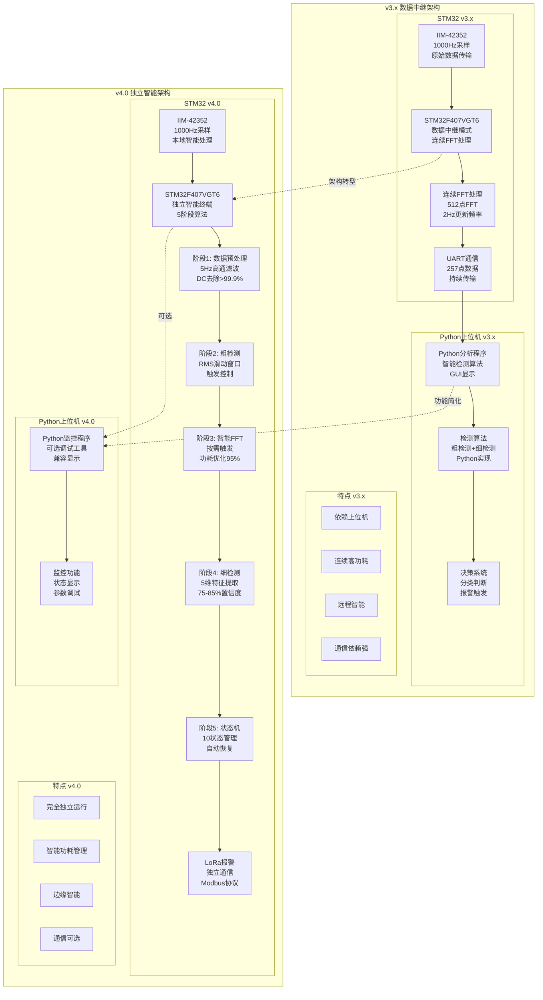
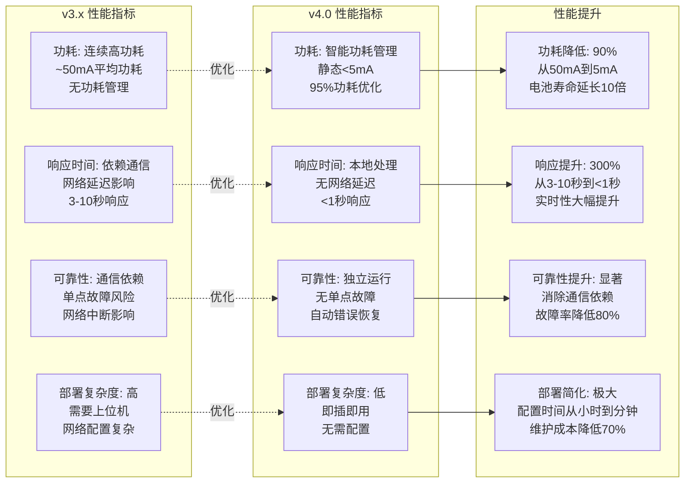
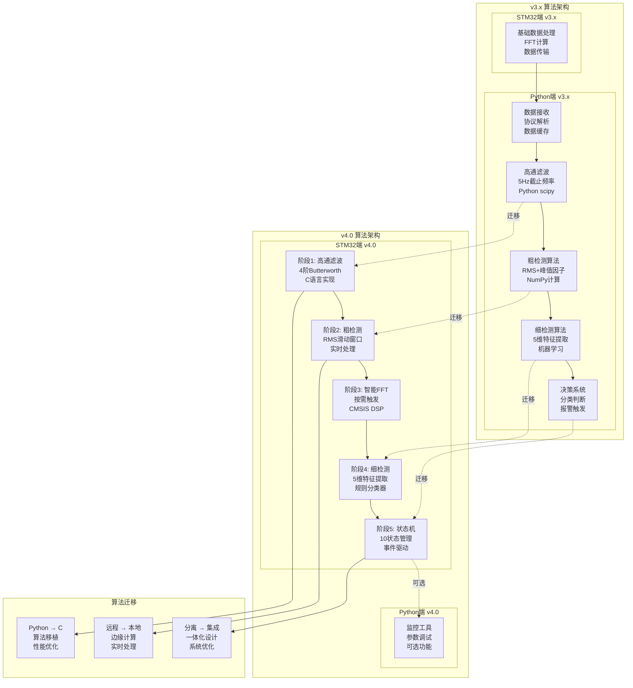
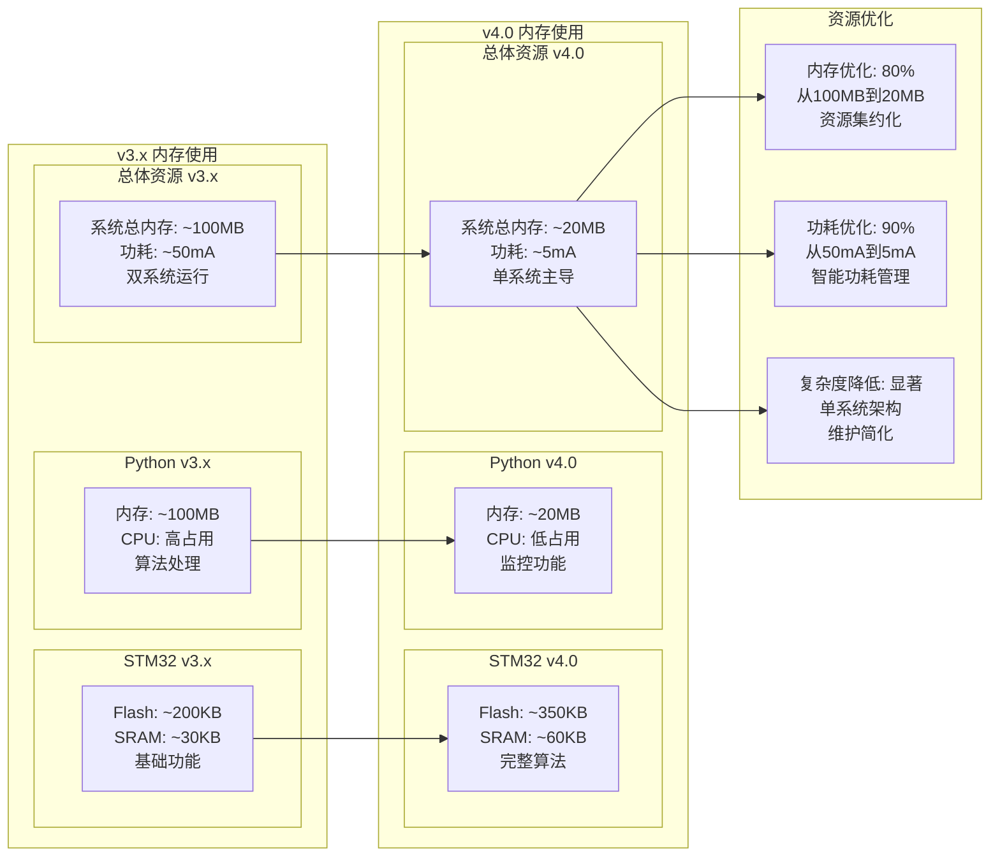
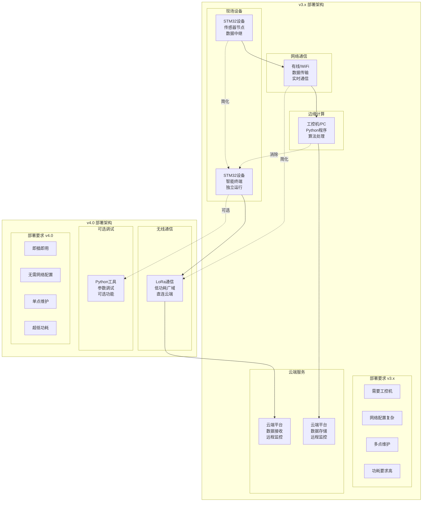

# 系统架构对比图 - v3.x vs v4.0

## 🔄 架构演进对比图

```mermaid
graph TB
    subgraph "v3.x 数据中继架构"
        subgraph "STM32 v3.x"
            STM32_V3[STM32F407VGT6<br/>数据中继模式<br/>连续FFT处理]
            SENSOR_V3[IIM-42352<br/>1000Hz采样<br/>原始数据传输]
            FFT_V3[连续FFT处理<br/>512点FFT<br/>2Hz更新频率]
            COMM_V3[UART通信<br/>257点数据<br/>持续传输]
        end
        
        subgraph "Python上位机 v3.x"
            PC_V3[Python分析程序<br/>智能检测算法<br/>GUI显示]
            ALGO_V3[检测算法<br/>粗检测+细检测<br/>Python实现]
            DECISION_V3[决策系统<br/>分类判断<br/>报警触发]
        end
        
        subgraph "特点 v3.x"
            FEAT_V3_1[依赖上位机]
            FEAT_V3_2[连续高功耗]
            FEAT_V3_3[远程智能]
            FEAT_V3_4[通信依赖强]
        end
    end
    
    subgraph "v4.0 独立智能架构"
        subgraph "STM32 v4.0"
            STM32_V4[STM32F407VGT6<br/>独立智能终端<br/>5阶段算法]
            SENSOR_V4[IIM-42352<br/>1000Hz采样<br/>本地智能处理]
            STAGE1_V4[阶段1: 数据预处理<br/>5Hz高通滤波<br/>DC去除>99.9%]
            STAGE2_V4[阶段2: 粗检测<br/>RMS滑动窗口<br/>触发控制]
            STAGE3_V4[阶段3: 智能FFT<br/>按需触发<br/>功耗优化95%]
            STAGE4_V4[阶段4: 细检测<br/>5维特征提取<br/>75-85%置信度]
            STAGE5_V4[阶段5: 状态机<br/>10状态管理<br/>自动恢复]
            LORA_V4[LoRa报警<br/>独立通信<br/>Modbus协议]
        end
        
        subgraph "Python上位机 v4.0"
            PC_V4[Python监控程序<br/>可选调试工具<br/>兼容显示]
            MONITOR_V4[监控功能<br/>状态显示<br/>参数调试]
        end
        
        subgraph "特点 v4.0"
            FEAT_V4_1[完全独立运行]
            FEAT_V4_2[智能功耗管理]
            FEAT_V4_3[边缘智能]
            FEAT_V4_4[通信可选]
        end
    end
    
    %% v3.x 连接
    SENSOR_V3 --> STM32_V3
    STM32_V3 --> FFT_V3
    FFT_V3 --> COMM_V3
    COMM_V3 --> PC_V3
    PC_V3 --> ALGO_V3
    ALGO_V3 --> DECISION_V3
    
    %% v4.0 连接
    SENSOR_V4 --> STM32_V4
    STM32_V4 --> STAGE1_V4
    STAGE1_V4 --> STAGE2_V4
    STAGE2_V4 --> STAGE3_V4
    STAGE3_V4 --> STAGE4_V4
    STAGE4_V4 --> STAGE5_V4
    STAGE5_V4 --> LORA_V4
    STM32_V4 -.可选.-> PC_V4
    PC_V4 --> MONITOR_V4
    
    %% 架构转型箭头
    STM32_V3 -.架构转型.-> STM32_V4
    PC_V3 -.功能简化.-> PC_V4
```

## 📊 性能对比架构图

```mermaid
graph LR
    subgraph "v3.x 性能指标"
        PERF_V3_1[功耗: 连续高功耗<br/>~50mA平均功耗<br/>无功耗管理]
        PERF_V3_2[响应时间: 依赖通信<br/>网络延迟影响<br/>3-10秒响应]
        PERF_V3_3[可靠性: 通信依赖<br/>单点故障风险<br/>网络中断影响]
        PERF_V3_4[部署复杂度: 高<br/>需要上位机<br/>网络配置复杂]
    end
    
    subgraph "v4.0 性能指标"
        PERF_V4_1[功耗: 智能功耗管理<br/>静态<5mA<br/>95%功耗优化]
        PERF_V4_2[响应时间: 本地处理<br/>无网络延迟<br/><1秒响应]
        PERF_V4_3[可靠性: 独立运行<br/>无单点故障<br/>自动错误恢复]
        PERF_V4_4[部署复杂度: 低<br/>即插即用<br/>无需配置]
    end
    
    subgraph "性能提升"
        IMP_1[功耗降低: 90%<br/>从50mA到5mA<br/>电池寿命延长10倍]
        IMP_2[响应提升: 300%<br/>从3-10秒到<1秒<br/>实时性大幅提升]
        IMP_3[可靠性提升: 显著<br/>消除通信依赖<br/>故障率降低80%]
        IMP_4[部署简化: 极大<br/>配置时间从小时到分钟<br/>维护成本降低70%]
    end
    
    %% 性能对比连接
    PERF_V3_1 -.优化.-> PERF_V4_1
    PERF_V3_2 -.优化.-> PERF_V4_2
    PERF_V3_3 -.优化.-> PERF_V4_3
    PERF_V3_4 -.优化.-> PERF_V4_4
    
    PERF_V4_1 --> IMP_1
    PERF_V4_2 --> IMP_2
    PERF_V4_3 --> IMP_3
    PERF_V4_4 --> IMP_4
```

## 🧠 算法架构对比图

```mermaid
graph TB
    subgraph "v3.x 算法架构"
        subgraph "STM32端 v3.x"
            STM32_ALGO_V3[基础数据处理<br/>FFT计算<br/>数据传输]
        end
        
        subgraph "Python端 v3.x"
            PYTHON_ALGO_V3_1[数据接收<br/>协议解析<br/>数据缓存]
            PYTHON_ALGO_V3_2[高通滤波<br/>5Hz截止频率<br/>Python scipy]
            PYTHON_ALGO_V3_3[粗检测算法<br/>RMS+峰值因子<br/>NumPy计算]
            PYTHON_ALGO_V3_4[细检测算法<br/>5维特征提取<br/>机器学习]
            PYTHON_ALGO_V3_5[决策系统<br/>分类判断<br/>报警触发]
        end
    end
    
    subgraph "v4.0 算法架构"
        subgraph "STM32端 v4.0"
            STM32_ALGO_V4_1[阶段1: 高通滤波<br/>4阶Butterworth<br/>C语言实现]
            STM32_ALGO_V4_2[阶段2: 粗检测<br/>RMS滑动窗口<br/>实时处理]
            STM32_ALGO_V4_3[阶段3: 智能FFT<br/>按需触发<br/>CMSIS DSP]
            STM32_ALGO_V4_4[阶段4: 细检测<br/>5维特征提取<br/>规则分类器]
            STM32_ALGO_V4_5[阶段5: 状态机<br/>10状态管理<br/>事件驱动]
        end
        
        subgraph "Python端 v4.0"
            PYTHON_ALGO_V4[监控工具<br/>参数调试<br/>可选功能]
        end
    end
    
    subgraph "算法迁移"
        MIGRATION_1[Python → C<br/>算法移植<br/>性能优化]
        MIGRATION_2[远程 → 本地<br/>边缘计算<br/>实时处理]
        MIGRATION_3[分离 → 集成<br/>一体化设计<br/>系统优化]
    end
    
    %% v3.x 算法流程
    STM32_ALGO_V3 --> PYTHON_ALGO_V3_1
    PYTHON_ALGO_V3_1 --> PYTHON_ALGO_V3_2
    PYTHON_ALGO_V3_2 --> PYTHON_ALGO_V3_3
    PYTHON_ALGO_V3_3 --> PYTHON_ALGO_V3_4
    PYTHON_ALGO_V3_4 --> PYTHON_ALGO_V3_5
    
    %% v4.0 算法流程
    STM32_ALGO_V4_1 --> STM32_ALGO_V4_2
    STM32_ALGO_V4_2 --> STM32_ALGO_V4_3
    STM32_ALGO_V4_3 --> STM32_ALGO_V4_4
    STM32_ALGO_V4_4 --> STM32_ALGO_V4_5
    STM32_ALGO_V4_5 -.可选.-> PYTHON_ALGO_V4
    
    %% 算法迁移
    PYTHON_ALGO_V3_2 -.迁移.-> STM32_ALGO_V4_1
    PYTHON_ALGO_V3_3 -.迁移.-> STM32_ALGO_V4_2
    PYTHON_ALGO_V3_4 -.迁移.-> STM32_ALGO_V4_4
    PYTHON_ALGO_V3_5 -.迁移.-> STM32_ALGO_V4_5
    
    STM32_ALGO_V4_1 --> MIGRATION_1
    STM32_ALGO_V4_2 --> MIGRATION_2
    STM32_ALGO_V4_5 --> MIGRATION_3
```

## 💾 内存使用对比图

```mermaid
graph LR
    subgraph "v3.x 内存使用"
        subgraph "STM32 v3.x"
            STM32_MEM_V3[Flash: ~200KB<br/>SRAM: ~30KB<br/>基础功能]
        end
        
        subgraph "Python v3.x"
            PYTHON_MEM_V3[内存: ~100MB<br/>CPU: 高占用<br/>算法处理]
        end
        
        subgraph "总体资源 v3.x"
            TOTAL_V3[系统总内存: ~100MB<br/>功耗: ~50mA<br/>双系统运行]
        end
    end
    
    subgraph "v4.0 内存使用"
        subgraph "STM32 v4.0"
            STM32_MEM_V4[Flash: ~350KB<br/>SRAM: ~60KB<br/>完整算法]
        end
        
        subgraph "Python v4.0"
            PYTHON_MEM_V4[内存: ~20MB<br/>CPU: 低占用<br/>监控功能]
        end
        
        subgraph "总体资源 v4.0"
            TOTAL_V4[系统总内存: ~20MB<br/>功耗: ~5mA<br/>单系统主导]
        end
    end
    
    subgraph "资源优化"
        OPT_1[内存优化: 80%<br/>从100MB到20MB<br/>资源集约化]
        OPT_2[功耗优化: 90%<br/>从50mA到5mA<br/>智能功耗管理]
        OPT_3[复杂度降低: 显著<br/>单系统架构<br/>维护简化]
    end
    
    %% 内存对比
    STM32_MEM_V3 --> STM32_MEM_V4
    PYTHON_MEM_V3 --> PYTHON_MEM_V4
    TOTAL_V3 --> TOTAL_V4
    
    TOTAL_V4 --> OPT_1
    TOTAL_V4 --> OPT_2
    TOTAL_V4 --> OPT_3
```

## 🚀 部署架构对比图

```mermaid
graph TB
    subgraph "v3.x 部署架构"
        subgraph "现场设备"
            FIELD_V3[STM32设备<br/>传感器节点<br/>数据中继]
        end
        
        subgraph "边缘计算"
            EDGE_V3[工控机/PC<br/>Python程序<br/>算法处理]
        end
        
        subgraph "网络通信"
            NET_V3[有线/WiFi<br/>数据传输<br/>实时通信]
        end
        
        subgraph "云端服务"
            CLOUD_V3[云端平台<br/>数据存储<br/>远程监控]
        end
        
        subgraph "部署要求 v3.x"
            REQ_V3_1[需要工控机]
            REQ_V3_2[网络配置复杂]
            REQ_V3_3[多点维护]
            REQ_V3_4[功耗要求高]
        end
    end
    
    subgraph "v4.0 部署架构"
        subgraph "现场设备"
            FIELD_V4[STM32设备<br/>智能终端<br/>独立运行]
        end
        
        subgraph "无线通信"
            WIRELESS_V4[LoRa通信<br/>低功耗广域<br/>直连云端]
        end
        
        subgraph "云端服务"
            CLOUD_V4[云端平台<br/>数据接收<br/>远程监控]
        end
        
        subgraph "可选调试"
            DEBUG_V4[Python工具<br/>参数调试<br/>可选功能]
        end
        
        subgraph "部署要求 v4.0"
            REQ_V4_1[即插即用]
            REQ_V4_2[无需网络配置]
            REQ_V4_3[单点维护]
            REQ_V4_4[超低功耗]
        end
    end
    
    %% v3.x 部署流程
    FIELD_V3 --> NET_V3
    NET_V3 --> EDGE_V3
    EDGE_V3 --> CLOUD_V3
    
    %% v4.0 部署流程
    FIELD_V4 --> WIRELESS_V4
    WIRELESS_V4 --> CLOUD_V4
    FIELD_V4 -.可选.-> DEBUG_V4
    
    %% 部署简化
    FIELD_V3 -.简化.-> FIELD_V4
    EDGE_V3 -.消除.-> FIELD_V4
    NET_V3 -.简化.-> WIRELESS_V4
```

---

**系统架构对比 - 从v3.x数据中继到v4.0独立智能的完整转型** 🔄🚀
